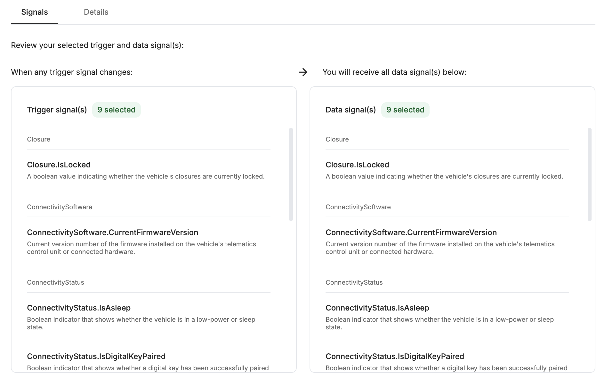
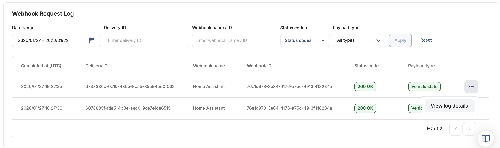
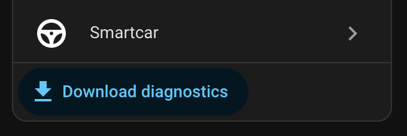

# Smartcar Integration – FAQ

Before diving into deeper troubleshooting, it’s worth checking a few common SmartCar resources. Many issues can be explained (or avoided) by understanding the platform, brand, or plan limitations.

### Pre-flight check list:

- [SmartCar Status](https://status.smartcar.com/) – Current platform status and known incidents
- [SmartCar Brands Status](https://brandreliability.smartcar.com/) – Known issues affecting specific car brands
- [Brand Data Frequency](https://smartcar.com/docs/help/frequencies) – How frequently are updates expected for each brand
- [Brand Data Reliability](https://smartcar.com/docs/help/reliability-and-freshness) – How reliable each brand is for data and commands
- [my.smartcar.com](https://my.smartcar.com/) – a useful app to check that you have the required permission (scopes) enabled for your vehicle and your integration (you'll need to re-authenticate your vehicle)

### Is your car brand supported in your region?

SmartCar availability varies by region. Check whether your car brand is supported where you live on [smartcar.com/global](https://smartcar.com/global)

### Is your car compatible with SmartCar, and what data is available?

Available sensors (data signals) depend on the brand, model, year, and region of your vehicle. See this [compatible vehicles table](https://smartcar.com/product/compatible-vehicles) to confirm what data and commands are supported for your vehicle.

### Is your Home Assistant server publicly accessible?

For webhooks to work, SmartCar servers must be able to reach your Home Assistant server via a **public**, **secure** (https) url. You will need a valid SSL certificate for your HA domain name. There are [separate guides](https://www.home-assistant.io/docs/configuration/remote/) on how to do this.
Make sure you have configured a valid **Home Assistant URL** in your [HA network settings](https://my.home-assistant.io/redirect/network/).
Test to see if this is accessible from the public internet using a tool like [httpstatus.io](https://httpstatus.io/): you should get a **200 OK** response.
For the OAuth setup flow to complete successfully, you must also have [my.home-assistant.io](https://my.home-assistant.io/) URL redirects configured correctly, as described in the installation guide.

### Can you update sensors through polling?

SmartCar favours webhooks instead of polling for vehicle updates. Webhooks really are more efficient, faster and unlimited. But polling is perfect for the initial setup and troubleshooting. Check if you can update the values of some sensors using the `homeassistant.update_entity` function. You can use this in a [HA automation](examples/poll-smartcar-simple.yaml) or head over to [Developer Tools - Actions](https://my.home-assistant.io/redirect/developer_services/) and run this action manually:

```
 - action: homeassistant.update_entity
   data:
     entity_id:
      - sensor.<make_model>_odometer
      - device_tracker.<make_model>_location
```

This request can take a very long time to receive a response from your car, between 20 seconds to a couple of minutes. If you open the sensor you've just updated in HA, you will see that there are additional attributes for it which will include: `Age` – the date and time at which the data was recorded by the vehicle `Fetched at` – the date and time at which Smartcar fetched the data These values do not necessarily update each time you make a request. They only update when Smartcar changes them (i.e. when it reaches out to your car brand's server, it'll update the `fetched_at` value).
**Remember:** you have a very limited number of poll requests and you could run out very quickly in testing.

### Is the SmartCar-HA integration configured correctly for webhooks?

If your Home Assistant _network_ configuration is correct (see above), the [SmartCar-HA integration](https://my.home-assistant.io/redirect/integration/?domain=smartcar) will provide you a webhook URL that looks like this:
`https://your-home-assistant.example.com/api/webhook/xxxxxxxxxxxxxxxxxxxxxx`
Test this url with [httpstatus.io](https://httpstatus.io/): a status **405 Method not allowed** response is expected and confirms the endpoint is reachable. While you're here, double check that this URL from your HA integration settings exactly matches the `Vehicle data callback URI` in your SmartCar dashboard -> Integrations settings. Also check that the Token configured in the SmartCar-HA integration is the **Application Management Token**, found at SmartCar Dashboard -> Configuration -> API Keys. It should look like this:


### Is your webhook configured correctly in the SmartCar dashboard?

The **free tier** currently only provides access to about 9 useful Trigger signals and 9 Data signals (subject to change). To access more, you’ll need to upgrade your SmartCar subscription plan. Is your car [subscribed](README.md#subscribe-vehicle) to the webhook?

**Important:** disable the `VehicleUserAccount` triggers and data signals in your webhook config. These have been [identified](README.md/issues/51#issuecomment-3682790541) as a cause of repeated `REAUTHENTICATE` errors.



**Important:** Webhook updates are definitely **not** sent in real time, despite what SmartCar might claim. See [Data Frequency](https://smartcar.com/docs/help/frequencies) for your brand and keep in mind that other factors could add delays too. SmartCar or any other third-party services never directly communicate with your car; instead the car at certain intervals sends the data to your manufacturer's server where it is cached, and SmartCar gets it from there. In order to get new webhook data sent to your HA, you have to do something to your car so data values change. For example, if you have the odometer enabled for webhook, take the car for a drive so that the odometer increases, then webhooks should trigger from SmartCar to HA and you should see the new values after a hopefully short period of time (brand data frequency updates permitting).

### Does your SmartCar subscription plan include the data signals you need?

Data signals availability is limited by your current SmartCar subscription plan. You might be able to view different data sensors for your car in the SmarCar dashboard, but it would depend on your subscription what signals are sent via the webhook. Review your active plan and current signals available to you in the [SmartCar billing dashboard](https://dashboard.smartcar.com/team/billing). Compare plans on the [pricing page](https://smartcar.com/pricing#pricing).

### Enabling extra data signals

If you've upgraded your plan, make sure you enable the extra signals in the webhook settings in your SmartCar dashboard. You must also enable the relevant sensors for your car in your Home Assistant. By default these are disabled. It shouldn't make a difference to the SmartCar-HA integration whether you are on a free tier or a paying customer, the only difference is in what data signals SmartCar is sending to you via webhooks. If you enable sensors in HA which are not also enabled in your webhook settings Data signals, these will not receive any data and will remain "Unavailable".

### Check the SmartCar log

In your SmartCar Dashboard go to Vehicles, select your vehicle from the list, then select Webhooks which should show the recent webhook logs for the vehicle. Hopefully all your log entries have a **200 OK** status code. On the most recent webhook log entry (top one) click the tree dots menu and select View Log Details This should show you more details about what SmartCar is trying to send via webhook, which signals were sent and which have failed and why. There is a few minutes delay until any new log entries are shown in the SmartCar dashboard log, this is normal.



### When all else fails: Start fresh

If you’re still stuck, a clean setup often resolves lingering issues:

- **Remove the SmartCar credentials** from the [integrations dashboard](https://my.home-assistant.io/redirect/integrations/): click the three dots in the top right corner and select [Application Credentials](https://my.home-assistant.io/redirect/application_credentials/). There, delete the SmartCar OAuth credentials.
- Remove the SmartCar-HA integration via HACS, and also
- Delete the car from your SmartCar dashboard.

Then restart HA and reinstall and reconfigure everything from scratch, following the installation guide. Once finished setting it up again, it should bring your car back in HA with all its sensor history.

### Keep in mind

SmartCar regularly pushes [platform updates and changes](https://smartcar.com/docs/changelog/latest). Occasionally, these updates may introduce unexpected behavior or break existing functionality.

### Getting community help

Before you open a new issue on GitHub, please work through the troubleshooting steps above.

Download the Diagnostics file from your car in Home Assistant and attach it or paste its contents in your GitHub issue. This is a neat json file redacted to remove any personal information and should help us understand your SmartCar-HA setup.



It would be extremely helpful if you would enable debugging and capture a few webhook payloads in the logs. To enable debugging, go to the [integration settings page](https://my.home-assistant.io/redirect/integration/?domain=smartcar), click the three dots in the top right corner and select **Enable debug logging**. Then just wait for a while, take your car for a quick drive, so that you get at least one webhook payload (you can check if a webhook payload was sent in the SmartCar dashboard logs).
When you **Disable debug logging** you will be prompted to download a log file (this is best done on a computer, not a phone).


In that log file you will find a line that starts with `DEBUG (MainThread) [custom_components.smartcar.webhooks] Received JSON from Smartcar:` followed by the **raw webhook payload** enclosed in single quotes (`'...'`) The JSON should start with a `{` and end with an `}`

### Posting logs and data

Please post your logs as easy to read as possible: If you're sending the entire logs, attach it as a file as you've downloaded it. If you're posting just the relevant JSON webhook payload, ideally first run it through a "[beautify](https://jsonformatter.org/)" app and mark it as JSON code when posting it here, like so:

    ```json
    PASTE YOUR JSON HERE
    ```

If the JSON or log is very long, make it collapsible:

    <details>
    <summary>This is my long JSON</summary>

    ```json
    PASTED JSON HERE
    ```

    </details>

It greatly improves the readability of the entire thread, and for the long collapsed section you will see:

<details>
<summary>This is my long JSON</summary>

```json
PASTED JSON HERE
```

</details>

### Sharing SmartCar logs and data

If you’re sharing logs or data from the SmartCar dashboard, screenshots are usually much easier to read than pasted text due to formatting which is not transferred on GitHub. Remember to mask any personal info in the screenshot.

All of this makes it significantly easier for contributors and volunteers to help you.

### Privacy

The raw log file and the raw webhook data will include some information about your car (make, model, year, location coordinates) and some unique identifiers that SmartCar uses. While these cannot be used in any malicious way and are only relevant for your HA server, you may wish to redact them before posting publicly.
