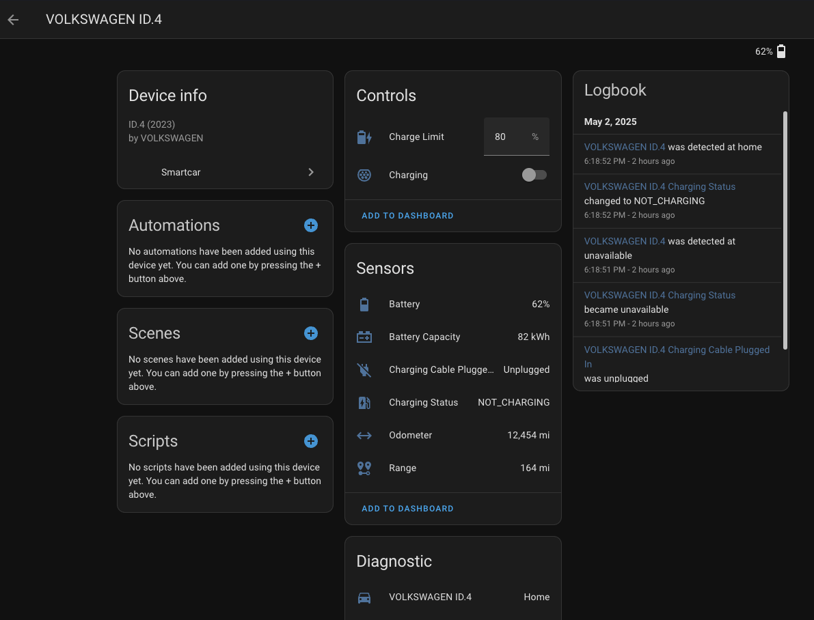

# Smartcar Integration for Home Assistant

[][hacs-repo]
[][hacs-repo]
[][releases]

Connect your compatible vehicle to Home Assistant using the [Smartcar API](https://smartcar.com/).

This integration provides various sensors and controls for vehicles linked through the Smartcar platform, allowing you to monitor and interact with your car directly within Home Assistant.

**Note:** This integration relies on the Smartcar service. Availability of specific features depends on your vehicle's make, model, year, your Smartcar account plan (especially API rate limits), and the permissions granted during authentication.

_Example showing entities for a Volkswagen ID.4_

## Prerequisites

1.  **Compatible Vehicle:** Your car must be [compatible with Smartcar](https://smartcar.com/product/compatible-vehicles) and the API must also be [supported in your country](https://smartcar.com/global).
2.  **Smartcar Developer Account:** You need a free developer account from Smartcar.
    * Go to [developer.smartcar.com](https://developer.smartcar.com/) and sign up.
    * Log in to your Developer Dashboard.
3.  **Ensure a Smartcar Application exists:**
    * In the dashboard, go to "Applications" and ensure an application was automatically created for you.
    * Rename your application if you want to (e.g., "Home Assistant Connect").

## Installation

### HACS

Installation through [HACS][hacs] is the preferred installation method.

[![Open the Smartcar integration in HACS][hacs-badge]][hacs-open]

1. Click the button above or go to HACS &rarr; Integrations &rarr; search for
   "Smartcar" &rarr; select it.
1. Press _DOWNLOAD_.
1. Select the version (it will auto select the latest) &rarr; press _DOWNLOAD_.
1. Restart Home Assistant then continue to [the setup section](#setup).

### Manual Download

1. Go to the [release page][releases] and download the `smartcar.zip` attached
   to the latest release.
1. Unpack the zip file and move `custom_components/smartcar` to the following
   directory of your Home Assistant configuration: `/config/custom_components/`.
1. Restart Home Assistant then continue to [the setup section](#setup).

## Setup

Configuration is done via the Home Assistant UI after installation.

1. Navigate to "Settings" &rarr; "Devices & Services"
1. Click "+ Add Integration"
1. Search for and select &rarr; "Smartcar"

Or you can use the My Home Assistant Button below.

[][config-flow-start]

Follow the instructions to configure the integration.

### Configuration Flow

#### Authorization Data Entry

1. Choose a name for your credentials and enter the **Client ID** and **Client Secret** which can be found in the [Smartcar dashboard](https://dashboard.smartcar.com/team/applications).
1. **Crucially, set the "Redirect URIs"** in the Smartcar settings for your application. You need to add **exactly** the URI your Home Assistant instance uses for OAuth callbacks.
    *  Most users will simply use the **My Home Assistant** URI: `https://my.home-assistant.io/redirect/oauth`
        > Note: This is not a placeholder. It is the URI that must be used unless you’ve disabled or removed the `default_config:` line from your configuration and disabled the [My Home Assistant Integration](https://www.home-assistant.io/integrations/my/).
    * Add **only** the correct URI for your setup.
1. Continue to the next step.
1. Select the **Permissions** you want Home Assistant to be able to access. To enable all entities in this integration, select all relevant permissions:

    * Get total distance traveled
    * Get the vehicle's location
    * Get EV/PHEV battery level, capacity & current range
    * Get details on whether the car is plugged in and charging
    * Get details on whether doors, windows & more are enabled
    * Get engine oil health
    * Get tire pressure details
    * Get fuel tank level
    * Control charging (start/stop & target charge)
    * Lock or unlock vehicle

    \* _Functionality for all permissions depends on car support_

1. Continue to the [next section](#authorization-via-smartcar-connect) which explains the steps to authorize your vehicle via [Smartcar connect](https://smartcar.com/docs/connect/what-is-connect).

#### Authorization via Smartcar Connect

1. You will be redirected to the Smartcar website (or a new tab will open).
1. Log in using the credentials for your **vehicle's connected services account** (e.g., your Volkswagen ID, FordPass account, Tesla account), **NOT** your Smartcar developer account credentials.
1. Review the permissions requested by Home Assistant (these should match the scopes you selected when creating the Smartcar application).
1. **Grant access** to allow Home Assistant to connect to your vehicle(s) via Smartcar.
1. You should be redirected back to Home Assistant.

#### Setup Complete

If successful, the integration will be added, and Home Assistant will create devices and entities for your connected vehicle(s). From here:

- Enable entities you want access after understanding [the impact on rate limits](#rate-limits--polling).
- Consider creating a [customized polling setup](#customized-polling) via automations.

## Entities

Several entities are created for for each connected vehicle (subject to vehicle compatibility and granted permissions) across the *device tracker*, *sensor*, *binary sensor*, *number*, *switch*, and *lock* platforms:

- [`device_tracker.<make_model>_location`](#device_trackermake_model_location)
- [`sensor.<make_model>_battery_capacity`](#sensormake_model_battery_capacity)
- [`sensor.<make_model>_battery`](#sensormake_model_battery)
- [`sensor.<make_model>_charging_status`](#sensormake_model_charging_status)
- [`sensor.<make_model>_engine_oil_life`](#sensormake_model_engine_oil_life)
- [`sensor.<make_model>_fuel`](#sensormake_model_fuel)
- [`sensor.<make_model>_odometer`](#sensormake_model_odometer)
- [`sensor.<make_model>_range`](#sensormake_model_range)
- [`sensor.<make_model>_tire_pressure_back_left`](#sensormake_model_tire_pressure_back_left)
- [`sensor.<make_model>_tire_pressure_back_right`](#sensormake_model_tire_pressure_back_right)
- [`sensor.<make_model>_tire_pressure_front_left`](#sensormake_model_tire_pressure_front_left)
- [`sensor.<make_model>_tire_pressure_front_right`](#sensormake_model_tire_pressure_front_right)
- [`binary_sensor.<make_model>_charging_cable_plugged_in`](#binary_sensormake_model_charging_cable_plugged_in)
- [`number.<make_model>_charge_limit`](#numbermake_model_charge_limit)
- [`switch.<make_model>_charging`](#switchmake_model_charging)
- [`lock.<make_model>_door_lock`](#lockmake_model_door_lock)

All entities have the following attributes:

* `age` The date at which the data was recorded by the vehicle*; _corresponds to [`sc-data-age`](https://smartcar.com/docs/api-reference/headers#param-sc-data-age)_
* `fetched_at` The date at which Smartcar fetched the data*; _corresponds to [`sc-data-fetched-at`](https://smartcar.com/docs/api-reference/headers#param-sc-fetched-at)_

\* _These will only be present when included in the API response._

Links to relevant API documentation are provided for each entity described below as well as the [permissions each entity requires](https://smartcar.com/docs/api-reference/permissions). When the required permissions are [not requested during setup](#authorization-data-entry), those entities will not be created.

### `device_tracker.<make_model>_location`

The GPS [location](https://smartcar.com/docs/api-reference/get-location) of the vehicle.

Enabled by default: :white_check_mark:  
Requires permissions: `read_location`  

### `sensor.<make_model>_battery_capacity`

The [battery capacity](https://smartcar.com/docs/api-reference/get-nominal-capacity) of this vehicle in kWh.

Enabled by default: :x:  
Requires permissions: `read_battery`  

### `sensor.<make_model>_battery`

The [state of charge](https://smartcar.com/docs/api-reference/evs/get-battery-level#param-percent-remaining) of the vehicle as a percentage.

Enabled by default: :white_check_mark:  
Requires permissions: `read_battery`  
Obtained concurrently with: [`sensor.<make_model>_range`](#sensormake_model_range)  

### `sensor.<make_model>_charging_status`

The [charging status](https://smartcar.com/docs/api-reference/evs/get-charge-status) of the vehicle.

Possible values:

- `​CHARGING`
- `FULLY_CHARGED`
- `NOT_CHARGING`

Enabled by default: :white_check_mark:  
Requires permissions: `read_charge`  
Obtained concurrently with: [`binary_sensor.<make_model>_charging_cable_plugged_in`](#binary_sensormake_model_charging_cable_plugged_in), [`switch.<make_model>_charging`](#switchmake_model_charging)  

### `sensor.<make_model>_engine_oil_life`

The [estimated engine oil life](https://smartcar.com/docs/api-reference/get-engine-oil-life) remaining for the vehicle.

Enabled by default: :x:  
Requires permissions: `read_engine_oil`  

### `sensor.<make_model>_fuel`

The [amount of fuel](https://smartcar.com/docs/api-reference/get-fuel-tank) remaining for the vehicle.

Enabled by default: :x:  
Requires permissions: `read_fuel`  

### `sensor.<make_model>_odometer`

The [odometer reading](https://smartcar.com/docs/api-reference/get-odometer) of the vehicle.

Enabled by default: :x:  
Requires permissions: `read_odometer`  

### `sensor.<make_model>_range`

The [estimated range remaining](https://smartcar.com/docs/api-reference/evs/get-battery-level#param-range) for the vehicle.

Enabled by default: :white_check_mark:  
Requires permissions: `read_battery`  
Obtained concurrently with: [`sensor.<make_model>_battery`](#sensormake_model_battery)  

### `sensor.<make_model>_tire_pressure_back_left`

The [back left tire pressure](https://smartcar.com/docs/api-reference/get-tire-pressure#param-back-left) of the vehicle.

Enabled by default: :x:  
Requires permissions: `read_tires`  
Obtained concurrently with: [`sensor.<make_model>_tire_pressure_back_right`](#sensormake_model_tire_pressure_back_right), [`sensor.<make_model>_tire_pressure_front_left`](#sensormake_model_tire_pressure_front_left), [`sensor.<make_model>_tire_pressure_front_right`](#sensormake_model_tire_pressure_front_right)  

### `sensor.<make_model>_tire_pressure_back_right`

The [back right tire pressure](https://smartcar.com/docs/api-reference/get-tire-pressure#param-back-right) of the vehicle.

Enabled by default: :x:  
Requires permissions: `read_tires`  
Obtained concurrently with: [`sensor.<make_model>_tire_pressure_back_left`](#sensormake_model_tire_pressure_back_left), [`sensor.<make_model>_tire_pressure_front_left`](#sensormake_model_tire_pressure_front_left), [`sensor.<make_model>_tire_pressure_front_right`](#sensormake_model_tire_pressure_front_right)  

### `sensor.<make_model>_tire_pressure_front_left`

The [front left tire pressure](https://smartcar.com/docs/api-reference/get-tire-pressure#param-front-left) of the vehicle.

Enabled by default: :x:  
Requires permissions: `read_tires`  
Obtained concurrently with: [`sensor.<make_model>_tire_pressure_back_left`](#sensormake_model_tire_pressure_back_left), [`sensor.<make_model>_tire_pressure_back_right`](#sensormake_model_tire_pressure_back_right), [`sensor.<make_model>_tire_pressure_front_right`](#sensormake_model_tire_pressure_front_right)  

### `sensor.<make_model>_tire_pressure_front_right`

The [front right tire pressure](https://smartcar.com/docs/api-reference/get-tire-pressure#param-front-right) of the vehicle.

Enabled by default: :x:  
Requires permissions: `read_tires`  
Obtained concurrently with: [`sensor.<make_model>_tire_pressure_back_left`](#sensormake_model_tire_pressure_back_left), [`sensor.<make_model>_tire_pressure_back_right`](#sensormake_model_tire_pressure_back_right), [`sensor.<make_model>_tire_pressure_front_left`](#sensormake_model_tire_pressure_front_left)  

### `binary_sensor.<make_model>_charging_cable_plugged_in`

Whether the vehicle [is currently plugged in](https://smartcar.com/docs/api-reference/evs/get-charge-status#param-is-plugged-in).

Enabled by default: :white_check_mark:  
Requires permissions: `read_charge`  
Obtained concurrently with: [`sensor.<make_model>_charging_status`](#sensormake_model_charging_status), [`switch.<make_model>_charging`](#switchmake_model_charging)  

### `number.<make_model>_charge_limit`

Change the [charge limit](https://smartcar.com/docs/api-reference/evs/get-charge-limit) by [setting it to a specific value](https://smartcar.com/docs/api-reference/evs/set-charge-limit).

Enabled by default: :x:  
Requires permissions: `read_charge`, `control_charge`  

### `switch.<make_model>_charging`

Change whether the vehicle is [currently charging](https://smartcar.com/docs/api-reference/evs/get-charge-status#param-state) by [starting or stopping charging](https://smartcar.com/docs/api-reference/evs/control-charge).

Enabled by default: :white_check_mark:  
Requires permissions: `read_charge`, `control_charge`  
Obtained concurrently with: [`sensor.<make_model>_charging_status`](#sensormake_model_charging_status), [`binary_sensor.<make_model>_charging_cable_plugged_in`](#binary_sensormake_model_charging_cable_plugged_in)  

### `lock.<make_model>_door_lock`

Change whether the vehicle is [currently locked](https://smartcar.com/docs/api-reference/get-lock-status) by [locking or unlocking](https://smartcar.com/docs/api-reference/control-lock-unlock).

Enabled by default: :white_check_mark:  
Requires permissions: `read_security`, `control_security`  

_Note: some models, e.g., VW ID.4 2023+ do not have this functionality._

## Rate Limits & Polling

* Smartcar's free developer tier typically has a limit of **500 API calls per vehicle per month**. Exceeding this may incur costs or stop the integration from working.
* By default, it uses **6 hour polling interval** and only fetches data required for enabled entities.
* Polling can be [customized as well](#customized-polling).

### Customized Polling

To customize polling, you can disable polling on the integration and write your own automation.

* First, configure the integration as described above.
* Go to _Settings_ &rarr; _Integartions_ (under _Devices & services_) &rarr; _Smartcar_
* Click the three dots to the right of the integration.
* Choose _System options_.
* Disable _Enable polling for changes_ and then click _Save_.
* Create an automation using [`homeassistant.update_entity`](https://www.home-assistant.io/integrations/homeassistant/#action-homeassistantupdate_entity) to refresh the desired value(s).

Examples are provided:

  - [`examples/poll-smartcar-simple.yaml`](examples/poll-smartcar-simple.yaml)
  - [`examples/poll-smartcar-custom.yaml`](examples/poll-smartcar-custom.yaml)
  - [`examples/poll-smartcar-excessive.yaml`](examples/poll-smartcar-excessive.yaml)

When updating an entity via `homeassistant.update_entity`:

  - A request to update an entity will also update related entities (see the _Obtained concurrently with_ notes on each entity above).
  - Requests to update several entities at once will be [batched](https://smartcar.com/docs/api-reference/batch), reducing excessive network requests and potentially limiting the number of API calls counted against your account.

For instance:

  - `homeassistant.update_entity` on [`sensor.<make_model>_battery`](#sensormake_model_battery) and [`sensor.<make_model>_range`](#sensormake_model_range) will make a single batch request that counts as **one** API call because the entities are related.
  - `homeassistant.update_entity` on [`sensor.<make_model>_battery`](#sensormake_model_battery) and [`sensor.<make_model>_odometer`](#sensormake_model_odometer) will make a single batch request that counts as **two** API calls since they are unrelated.

## Known Issues / Limitations

* **Vehicle Compatibility:** Not all features are supported by all vehicle makes/models/years via the Smartcar API. Entities for unsupported features (e.g., [fuel status](#sensormake_model_fuel) for EVs or [lock control](#lockmake_model_door_lock) for VW ID.4 2023+) may or may still be created, but not function. Check the Smartcar compatibility details for your specific vehicle.
* **API Latency:** There can be significant delays (seconds to minutes) between sending a command (e.g., start charging) and the vehicle executing/reporting the change back through the API. The state in Home Assistant will update after the next successful data poll.
* **Rate Limits:** Be mindful of the 500 calls/vehicle/month limit on the free tier.

## Support / Issues

Please report any issues you find with this integration by opening an issue on the [GitHub Issues page](https://github.com/tube0013/Smartcar-HA/issues).

[hacs]: https://hacs.xyz/
[hacs-repo]: https://github.com/hacs/integration
[hacs-badge]: https://my.home-assistant.io/badges/hacs_repository.svg
[hacs-open]: https://my.home-assistant.io/redirect/hacs_repository/?owner=tube0013&repository=Smartcar-HA&category=integration
[releases]: https://github.com/tube0013/Smartcar-HA/releases
[config-flow-start]: https://my.home-assistant.io/redirect/config_flow_start/?domain=smartcar
